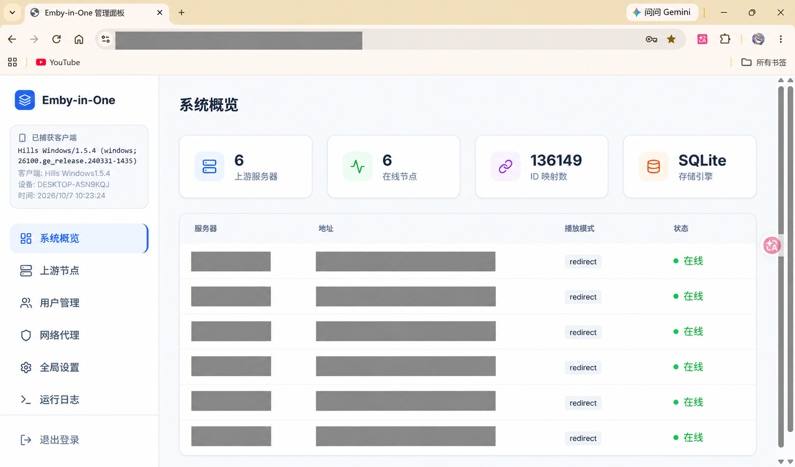
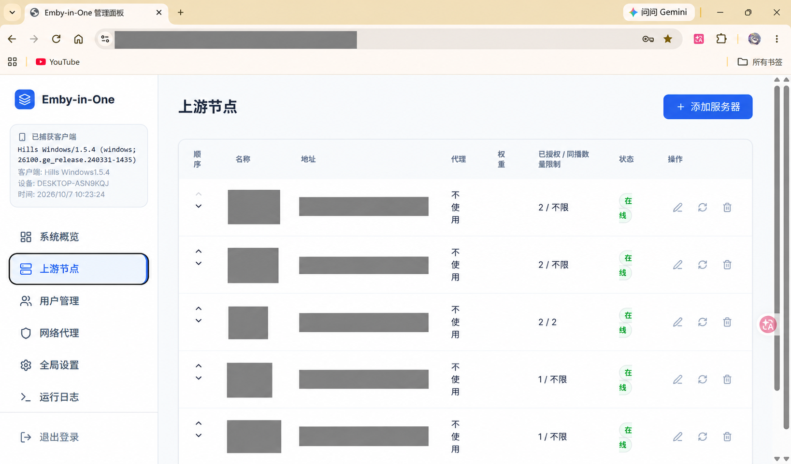
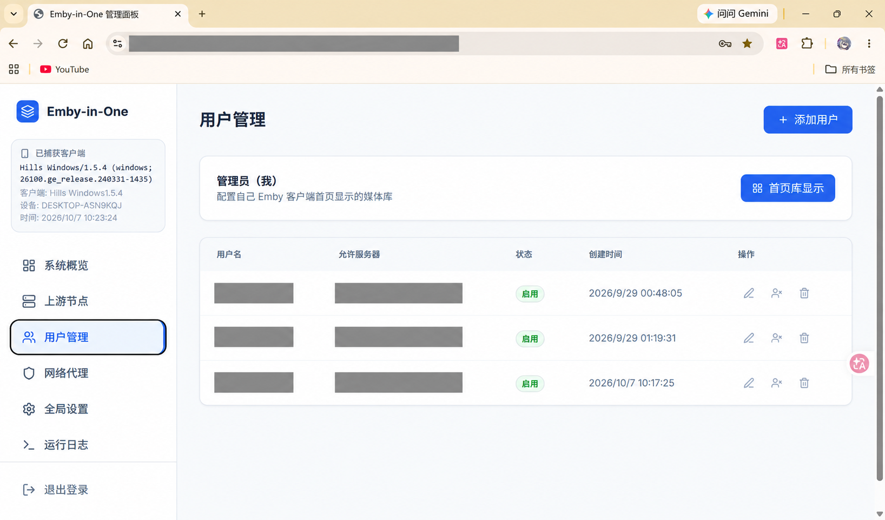

# Emby-In-One

A multi-upstream aggregation proxy for Emby clients: one entry point for multiple Emby servers, with media merging, user access control, independent watch state and playback management.

[](https://github.com/Zkunlun/Emby-In-One/releases)
[](LICENSE)

[Quick start](#quick-start) · [Documentation](docs/en/README.md) · [Changelog (Chinese)](Update.md) · [Security](SECURITY.md#english-security-policy) · [简体中文](README.md)

This project continues development and maintenance of [ArizeSky/Emby-In-One](https://github.com/ArizeSky/Emby-In-One).

## Who this is for

- You have access to several Emby servers and want to browse, search and choose playback sources through one client entry point.
- You want to assign upstream access to different people and keep each regular user's progress, played state and favorites separate.
- You want a Web panel to manage upstreams, stream routes, users and everyday operation.

You need reachable Emby upstreams and their account credentials or API Keys, plus an environment to run EIO. EIO aggregates existing resources; it does not include a media library.

## Features

| Capability | Description |
| --- | --- |
| **Aggregation and media merging** | Combine libraries/search results, group movies, series and episodes by work identity, and retain selectable versions. |
| **User access and watch state** | Assign sources to regular users and isolate progress, played state and favorites. Merged versions share the same user's state; authorization capacity and device limits are also available. |
| **Playback modes and stream routes** | Proxy/direct modes, ordered backup routes and mode-specific handling of recoverable failures before media transmission. |
| **Upstream access and client identity** | Username/password or API Key, passthrough, Infuse/Hills/CapyPlayer presets and custom identity. |
| **Web administration and library counts** | Manage sources, users, proxies, settings and logs, with movie, series and episode counts. |
| **Deployment and operations** | Release binaries, Docker source builds and Go source execution, with an SSH menu, log rotation and status checks. |

## Interface preview

The panel brings upstreams, users, network proxies, settings and logs together.

### System overview



System overview: upstream and runtime status. Chinese UI from a running instance; sensitive fields redacted and image scaled for display.

### Upstream management



Upstream management: Chinese UI from a running instance; server names and addresses redacted and image scaled for display.

View source status and assigned-user counts, reorder sources, and open authentication, playback-mode and stream-route settings.

### Users and permissions



User management: Chinese UI from a running instance; usernames and server names redacted and image scaled for display.

View regular-user status and assigned sources, then use edit actions to configure accessible upstreams and home-library entry visibility. Hiding entries does not revoke access. See [first use](docs/en/getting-started.md).

## Quick start

**Recommended: Linux Release binary + systemd, with no local Go build environment required.**

Prepare Linux/systemd, root/sudo access, Bash, curl, grep, sed, sha256sum and other script utilities, plus connectivity to the GitHub API and Release downloads. Full architecture/deployment requirements are in [installation](docs/en/installation.md).

First installation of the latest formal release:

```bash
curl -fsSL -o release-install.sh https://github.com/Zkunlun/Emby-In-One/releases/latest/download/release-install.sh
sudo bash release-install.sh
```

The script installs and starts the service, using `/opt/emby-in-one` by default. First initialization creates the local administrator `admin`; save the random password printed at the end.

| Entry | Default address |
| --- | --- |
| Admin panel | `http://server-ip:8096/admin` |
| Emby client | `http://server-ip:8096` |

Continue with first use below. For pinned versions, Docker/Compose or source execution, see [installation](docs/en/installation.md). Existing instances should first read [upgrades and backups](docs/en/operations.md#version-upgrades).

## First use

1. **Log into the panel:** open the admin address with the EIO local administrator from the installation output.
2. **Add an upstream:** enter its Emby address, choose username/password or API Key, and select identity according to upstream requirements. Check status after saving. Username-authenticated passthrough without a captured identity requires one real Emby-client login as EIO administrator; see [upstream setup](docs/en/getting-started.md#step-2-add-an-upstream).
3. **Create and authorize a regular user:** create a local account and explicitly select accessible upstreams. Selecting none grants no upstream access.
4. **Connect a client:** use the EIO client address and that regular user's local account.
5. **Verify access/playback:** browse authorized media and play an item; choose a specific source for multiple versions. See [troubleshooting](docs/en/troubleshooting.md) for errors.

EIO local accounts log into EIO; upstream accounts let EIO connect to sources. Regular users have independent local watch state; administrators retain upstream-account watch semantics. See the [full first-use guide](docs/en/getting-started.md).

## Playback modes and limits

| Mode | Media path | Requirements |
| --- | --- | --- |
| `proxy` (default) | EIO forwards upstream media | EIO can reach the stream source; clients connect to EIO. An upstream may use a server-side HTTP network proxy. |
| `redirect` | EIO redirects clients directly to the upstream stream URL | Clients must reach the stream address. Saves EIO media bandwidth; cannot bind a server-side HTTP network proxy. |

**Direct-playback credential exposure:** client-visible redirect URLs can contain upstream tokens/API Keys. Their holders may bypass EIO with the shared upstream account's permissions. Use a restricted upstream account, or proxy if this tradeoff is unacceptable. See [upstream access and playback](docs/en/playback-and-upstream.md) for identity and route handling.

- **Access and display differ:** hiding a library entry does not remove authorization; search/playback still follow access rules.
- **Capacity and active devices differ:** maxConcurrent limits assigned regular users per upstream. A regular user's active devices on that upstream have a separate constraint; see [users and permissions](docs/en/users-and-permissions.md).
- **Counts and merging differ:** counts sum official data from authorized online sources without cross-source deduplication; see [library counts](docs/en/media-counts.md).
- **Keep matching upgrade backups:** preserve configuration, database, user-password.key and related files consistently. Installer rollback is not a full data backup; old user databases have version restrictions. See [operations](docs/en/operations.md#version-upgrades).

Merging discovers candidates on demand and retains candidate/pagination limits; see [merge rules](docs/en/media-merge.md). Existing acceptance and untested areas are in [release validation](docs/en/release-v1.4.9-validation.md). Credential storage and risks are in the [security policy](SECURITY.md#english-security-policy).

## Documentation and FAQ

| Task | Guides |
| --- | --- |
| Install and get started | [Installation](docs/en/installation.md) · [First use](docs/en/getting-started.md) |
| Configure users and playback | [Configuration](docs/en/configuration.md) · [Permissions](docs/en/users-and-permissions.md) · [Upstreams/playback](docs/en/playback-and-upstream.md) |
| Back up, update and troubleshoot | [Operations](docs/en/operations.md) · [Troubleshooting](docs/en/troubleshooting.md) |
| Understand merging and counts | [Media merging](docs/en/media-merge.md) · [Library counts](docs/en/media-counts.md) |
| All documentation and development | [Documentation index](docs/en/README.md) · [Development](docs/en/development.md) |

### Why is there no media after installation?

Initial configuration has no upstream. Add a reachable Emby source and grant regular-user access; follow [first use](docs/en/getting-started.md).

### Which address and account should clients use?

Connect to EIO's client address, default `http://server-ip:8096`, with an EIO local account. The panel is at /admin; upstream credentials are for source access. See [account roles](docs/en/getting-started.md#distinguish-the-three-accounts).

### Why do counts differ from merged lists?

Counts sum official movie, series and episode totals per source, including repeated works. Lists group by work identity. Cache/error behavior is documented in [library counts](docs/en/media-counts.md).

### What if I forget the administrator password?

Its irreversible hash cannot reveal the original password. Reset through the SSH menu or the binary CLI with the service stopped, then log clients in again. See [password reset](docs/en/operations.md#administrator-password-reset).

## Contributing

Report issues and compatibility feedback through [Issues](https://github.com/Zkunlun/Emby-In-One/issues), or contribute through [Pull Requests](https://github.com/Zkunlun/Emby-In-One/pulls). Include EIO/client versions, authentication/playback mode, reproduction steps and redacted logs.

See [development](docs/en/development.md) for builds and verification. Report vulnerabilities privately under the [security policy](SECURITY.md#reporting-a-vulnerability-in-english).

## Credits and license

Thanks to [ArizeSky](https://github.com/ArizeSky) for the original project, early architecture and core features, and to contributors, issue reporters and client testers in both repositories. Original code, design and historical contributions belong to their respective authors/contributors. This repository continues developing, maintaining and releasing the current Go mainline.

Original Node.js V1.2.1 remains a [historical reference](legacy/README.md), excluded from current Go builds. [Old documentation](README_EN_V1.2.1.md) remains separate. See [GitHub Contributors](https://github.com/Zkunlun/Emby-In-One/graphs/contributors) for contributions.

This project is released under the **GNU General Public License v3.0**. Follow [GPL-3.0](LICENSE) when modifying or redistributing.
